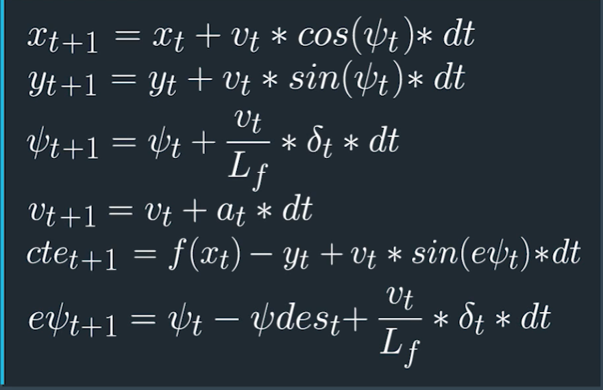

# CarND-Controls-MPC
Self-Driving Car Engineer Nanodegree Program

---

## MPC Controll

** MPC ** -> Model Predictive Control

MPC is an advanced method of process control that is used to control a process while satisfying a set of constraints.

**Model Implementation : **

  ** State Vector ** :

  x, y : Car's position.

  psi : Car's heading direction.

  v : Car's velocity
  cte : Cross-track error.

  epsi : Orientation error

  ** Equations : **

  

  MPC attempts to approximate a continuous reference trajectory by means of discrete paths between actuations. Larger values of dt result in less frequent actuations, which makes it harder to accurately approximate a continuous reference trajectory. This is sometimes called "discretization error".

  N, dt, and T are hyperparameters you will need to tune for each model predictive controller.

  **Goal : **
  The goal of Model Predictive Control is to optimize the control inputs: [δ,a]. An optimizer will tune these inputs until a low cost  vector of control inputs is found.

  Note : The cost function parameters were tuned by try-and-error .
